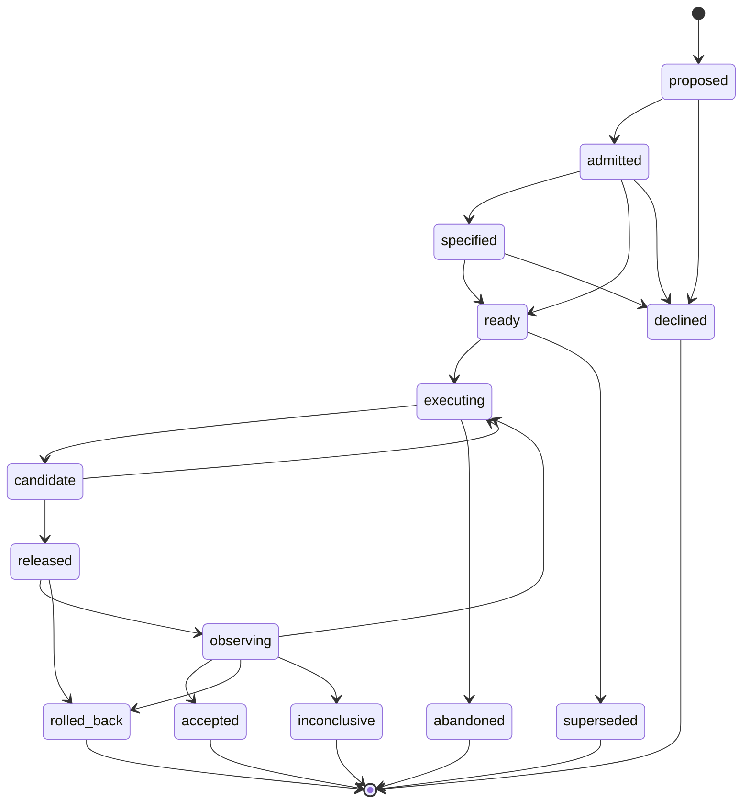
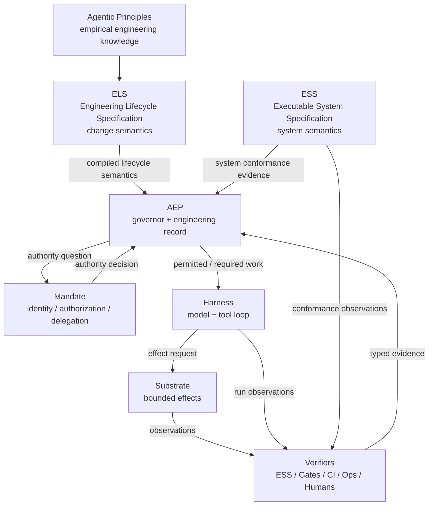

# Engineering Lifecycle Specification (ELS)

> **Note, 2026-10-05:** this proposal predates the rename. The project is now *engineering
> protocols*: the crate `b10x-canon-engineering`, the command line `canon-engineering`. The text
> below keeps the name it was written under, and stories cite it by section.

**Codename:** Canon  
**Proposed repository:** `beyond10x/els`  
**Proposed CLI:** `els`  
**Status:** Design proposal  
**Date:** 2026-10-03

---

## 1. Summary

Engineering Lifecycle Specification (ELS) is a proposed formal specification for the lifecycle of an engineering change.

ELS defines what an engineering change **means**, what claims may be made about it, what artifacts and revisions those claims refer to, what evidence can establish or invalidate them, which obligations apply, which transitions are legal, and which terminal outcomes are valid.

ELS does **not** execute agents, store work, authorize actors, run CI, deploy software, or implement a workflow runtime. It specifies the semantics that those systems implement.

The central architectural split is:

> **ESS specifies the system.**  
> **ELS specifies the engineering change lifecycle.**  
> **AEP governs an instance of that lifecycle.**

A fuller ecosystem statement is:

> **ELS defines engineering work. AEP governs it. Mandate establishes authority. Harness performs it. Substrate bounds effects. ESS, Gates, CI, operations, and humans produce evidence.**

The primary design objective is to replace process-by-convention with **proof-carrying engineering change**.

A change advances because required claims have been established over the correct revisions with admissible, sufficiently fresh, sufficiently independent evidence — not because a human or agent says that a phase is complete.

---

## 2. Motivation

Traditional software-development lifecycle models are usually expressed as activities:

```text
requirements
  -> design
  -> implementation
  -> testing
  -> deployment
```

That representation is increasingly inadequate in an agentic engineering environment.

Agents can perform implementation, test generation, review preparation, diagnosis, migration, deployment preparation, and documentation rapidly and concurrently. The scarce property is therefore not whether an activity was performed, but whether the engineering system can establish:

- what intent was authorized;
- which version of that intent is current;
- what system behavior was specified;
- what implementation revision claims to satisfy it;
- what obligations this particular change incurred;
- what evidence establishes those obligations;
- who or what produced that evidence;
- whether the producer was independent where independence is required;
- whether the evidence still applies to the current revision;
- whether the evidence is still fresh;
- what authority is required for the next effect;
- what can be recovered if the effect fails;
- whether the intended real-world outcome actually occurred;
- and whether the change may legitimately be called complete.

A lifecycle for agentic engineering therefore needs to be specified in terms of **claims, evidence, authority, revision binding, obligations, transitions, invalidation, recovery, and outcomes**, not merely activities.

The unit of the lifecycle is an **engineering change**.

It is deliberately not a task, story, pull request, agent run, commit, deployment, or ticket. All of those can be artifacts or attempts within one change.

---

## 3. Current ecosystem context

This proposal is intended as an extraction and clarification of semantics that already appear across the Beyond10x stack.

As of this design:

- **AEP** describes governed planning and governed tasks. It decides legal and earned moves, consumes evidence, resolves capabilities and obligations, drives workflows, and observes agent/check behavior.
- **ESS** models system intent as validated typed data, compiles deterministic intermediate representation, derives contracts, and synthesizes conformance obligations.
- **Entity Runtime** provides generic deterministic entity/lifecycle decision mechanics, replay, storage abstractions, and state transition semantics.
- **Workflow** provides a generic domain model for user-maintained workflow definitions and immutable revisions.
- **Harness** owns the model/tool loop, approvals, budgets, tools, and run records.
- **Substrate** provides confined execution with explicit capabilities and observed outcomes.
- **Mandate** occupies the identity, authorization, and constrained-delegation boundary.
- **Gates**, CI systems, ESS conformance, operations, and humans can act as evidence producers.

ELS is proposed because none of these boundaries should own the normative definition of **what an engineering change is and what it must prove**.

### 3.1 Extraction principle

AEP should not be the semantic owner of "what constitutes a valid engineering lifecycle."

AEP should be able to consume a lifecycle definition and govern concrete changes against it.

Analogously:

```text
ESS specification
    -> implementation conforms to system semantics

ELS specification
    -> governor conforms to engineering-lifecycle semantics
```

AEP is expected to become the first and reference governor for ELS-defined work, but ELS must remain meaningful without AEP.

---

## 4. Naming

### 4.1 Formal name

**Engineering Lifecycle Specification**

Abbreviation:

```text
ELS
```

The name is intentionally plain and standards-like.

It mirrors the role played by Executable System Specification without implying that both projects must share an implementation.

### 4.2 Codename

**Canon**

"Canon" refers to an authoritative body of rules defining what counts as valid.

It is suitable as an internal codename because ELS defines the authoritative semantics of a valid engineering change, rather than performing the change itself.

### 4.3 Proposed repository and surfaces

```text
Project:             Engineering Lifecycle Specification
Abbreviation:        ELS
Codename:            Canon
Repository:          beyond10x/els
CLI:                 els
Authoring format:    els/1
Compiled IR:         els-ir/1
Change envelope:     els-change/1
Conformance report:  els-conformance-report/1
```

The public identity should be **ELS**. "Canon" should remain a codename unless a later naming decision deliberately makes it the product name.

---

## 5. Core proposition

ELS specifies **engineering truth** about a change.

ESS specifies **system truth** about a system.

AEP maintains and governs the current **engineering state of knowledge** for an instantiated change.

A concise distinction is:

```text
ESS:
    What must the resulting system mean and do?

ELS:
    What must become true, and be proven, for this engineering change
    to advance and conclude?

AEP:
    Given this change, its current evidence, rules, authority, and state,
    what is currently allowed, required, established, contradicted,
    unknown, or complete?
```

---

## 6. Design principles

### 6.1 The change is the durable subject

The primary lifecycle subject is `Change`.

An agent run is an attempt.

A commit is an implementation revision.

A pull request is a collaboration/review surface.

A deployment is an effect.

A test run is evidence.

None of those is the change itself.

A change may contain:

```text
Change
├── intent revisions
├── specification revisions
├── plan revisions
├── implementation revisions
├── implementation attempts
├── agent runs
├── reviews
├── verification evidence
├── release candidates
├── deployments
├── operational observations
└── final disposition
```

### 6.2 Claims, not phases, are fundamental

Human-readable phases remain useful:

```text
Intent
Specification
Planning
Implementation
Verification
Integration
Release
Operation
Acceptance
```

But phases are projections.

The formal semantics operate on claims such as:

```text
intent.accepted
specification.valid
plan.accepted
implementation.exists
implementation.conforms
tests.pass
security.acceptable
release.reproducible
deployment.healthy
objective.realized
```

This prevents ELS from becoming an encoded waterfall.

### 6.3 Unknown is first-class

ELS uses three-valued evaluation:

```text
TRUE
FALSE
UNKNOWN
```

Their meanings are distinct:

- `TRUE`: applicable evidence establishes the predicate.
- `FALSE`: applicable evidence contradicts the predicate.
- `UNKNOWN`: there is insufficient applicable evidence to decide.

Only `TRUE` satisfies a positive lifecycle gate.

Examples:

```text
tests never run                          -> UNKNOWN
tests ran and failed                     -> FALSE
tests ran and passed                     -> TRUE
tests passed for revision R1; current R2 -> UNKNOWN
freshness expired                        -> UNKNOWN
```

This distinction is operationally important.

`UNKNOWN(test.pass)` implies "obtain applicable evidence."

`FALSE(test.pass)` implies "repair or change the subject."

### 6.4 Evidence is bound to subjects and revisions

Evidence is never merely "tests passed."

It establishes a proposition about an identified subject revision.

For example:

```yaml
kind: test_result

subject:
  kind: implementation
  digest: sha256:9c992f...

producer:
  id: ci/github/unit-tests
  version: v14

observed_at: 2026-10-03T13:04:22Z

result:
  verdict: pass
  passed: 842
  failed: 0
```

Changing the relevant subject revision invalidates applicability unless the evidence kind explicitly declares otherwise.

### 6.5 Progress is earned, not asserted

A lifecycle transition is valid only when all normative conditions are satisfied.

Conceptually:

```text
advance(change, transition) =
    legal_transition
  AND precondition == TRUE
  AND authority_requirement_satisfied
  AND obligations_satisfied
  AND evidence_requirements == TRUE
  AND invariants_hold
```

No human, agent, planner, issue tracker, or workflow executor can bypass this by writing a status field.

### 6.6 Risk derives obligations

ELS should avoid maintaining a separate hand-authored workflow for every risk category.

Instead:

```text
facts
  -> applicable rules
  -> obligations
  -> evidence requirements
  -> authority requirements
  -> recovery requirements
```

Examples:

- persistent-data impact derives migration and recovery obligations;
- public-contract impact derives compatibility obligations;
- security-boundary impact derives independent security evidence;
- consequential production reach derives stronger authority and operational observation requirements.

### 6.7 Negative outcomes are valid outcomes

A lifecycle must not equate "not shipped" with "unfinished."

Legitimate terminal outcomes may include:

```text
accepted
declined
rejected
superseded
inconclusive
abandoned
rolled_back
```

A fully investigated change can legitimately terminate as `declined`.

### 6.8 Recovery is normative

The specification must define failure and recovery semantics, not merely happy-path advancement.

A consequential effect should answer:

- Is it reversible?
- What evidence proves recovery succeeded?
- Which claims become invalid after rollback?
- Which previous state becomes authoritative?
- When is forward recovery required instead?
- Which effects are irreversible?

### 6.9 Performer-neutral semantics

ELS must not assume a human developer or an AI agent.

The same lifecycle should be implementable by:

- one human;
- one agent;
- multiple agents;
- mixed human/agent teams;
- CI automation;
- autonomous engineering systems.

The subject is the engineering change, not the performer.

### 6.10 Determinism belongs outside model behavior

A language model may propose, implement, diagnose, summarize, or plan.

It must not be the source of truth for:

- current lifecycle state;
- authority;
- evidence applicability;
- revision identity;
- freshness;
- obligation satisfaction;
- legal transitions;
- completion.

Those semantics must be deterministically evaluable.

---

## 7. Non-goals

ELS is explicitly **not**:

- an issue tracker;
- a planning store;
- a backlog;
- a sprint methodology;
- Scrum;
- Kanban;
- a pull-request model;
- a Git model;
- a CI system;
- a deployment orchestrator;
- an agent runtime;
- a model-selection framework;
- an authorization service;
- a secret store;
- a worktree manager;
- a project-management UI;
- a general-purpose workflow engine.

ELS may define semantics that these systems implement or expose.

It does not absorb their responsibilities.

---

## 8. Formal domain model

The intentionally small core vocabulary is:

```text
Lifecycle
Change
Artifact
ArtifactRevision
Claim
Predicate
Fact
EvidenceKind
EvidenceRecord
Obligation
AuthorityRequirement
Transition
InvalidationRule
RecoveryRule
Outcome
```

### 8.1 Change

A `Change` is a durable attempt to alter an engineering system or its accepted understanding.

Minimum identity:

```yaml
change:
  id: CHG-123
  kind: software.change
  lifecycle: software.change/1
```

A change has stable identity even as its artifacts and claims evolve.

### 8.2 Artifact

An artifact is a revisioned subject involved in the change.

Examples:

```text
intent
system_specification
plan
implementation
release
deployment
migration
runbook
decision_record
```

ELS specifies artifact semantics, not necessarily artifact storage.

### 8.3 Claim

A claim is a named proposition that can be evaluated.

Example:

```yaml
claim:
  id: implementation.conforms
  subject: implementation
```

A claim does not become true because it is declared.

Its truth is derived.

### 8.4 Evidence

Evidence is a typed observation that can establish, contradict, or leave a claim unresolved.

An evidence kind declares:

- admissible subject kinds;
- binding semantics;
- producer constraints;
- freshness rules;
- interpretation rules;
- claims it may establish or contradict.

### 8.5 Obligation

An obligation is a required proof or action derived from the lifecycle and change facts.

An obligation must be inspectable before completion.

Example:

```yaml
obligation:
  id: verify.compatibility
  requires:
    evidence:
      kind: compatibility_report
```

### 8.6 Authority requirement

ELS may declare that a transition requires authority.

It does not authenticate or authorize the actor itself.

Example:

```yaml
authority:
  capability: production.release
```

A conforming governor asks an authority provider to resolve this requirement.

### 8.7 Transition

A transition maps one lifecycle state to another under explicit predicates.

A transition may require:

- claims;
- facts;
- evidence;
- obligations;
- authority;
- invariants;
- recovery conditions.

### 8.8 Outcome

An outcome is a terminal interpretation of the change.

Terminality does not imply success.

Examples:

```text
accepted       successful realized change
declined       valid decision to make no change
superseded     replaced by another change
inconclusive   investigation completed without sufficient conclusion
rolled_back    released effect intentionally reversed
abandoned      lifecycle terminated without satisfying a planned outcome
```

---

## 9. Lifecycle authoring example

The following illustrates the proposed authoring style.

It is intentionally incomplete but concrete enough to define the target semantics.

```yaml
format: els/1

lifecycle:
  id: software.change
  revision: 1

subject:
  kind: change

inputs:
  risk:
    type: enum
    values:
      - trivial
      - normal
      - elevated
      - critical

  affects_runtime_behavior:
    type: boolean

  affects_public_contract:
    type: boolean

  affects_persistent_data:
    type: boolean

  affects_security_boundary:
    type: boolean

  production_reach:
    type: enum
    values:
      - none
      - reversible
      - consequential

artifacts:
  intent:
    revisions: versioned
    required:
      - objective
      - constraints
      - non_goals
      - acceptance

  system_specification:
    revisions: versioned
    required_when:
      any:
        - input.affects_runtime_behavior
        - input.affects_public_contract
        - input.affects_persistent_data

  plan:
    revisions: versioned

  implementation:
    revisions: content_addressed

  release:
    revisions: immutable

evidence:
  intent_review:
    subject: intent
    binds_revision: true

  system_conformance:
    subject: implementation
    binds:
      - implementation.revision
      - system_specification.revision

  test_result:
    subject: implementation
    binds_revision: true

  code_review:
    subject: implementation
    binds_revision: true

  security_review:
    subject: implementation
    binds_revision: true

  build_provenance:
    subject: release
    binds_revision: true

  deployment_result:
    subject: release
    binds_revision: true

  operational_observation:
    subject: deployment
    binds_revision: true
    freshness: 30m

claims:
  intent.accepted:
    true_when:
      evidence:
        kind: intent_review
        verdict: approved
        current_revision: true

  specification.valid:
    true_when:
      all:
        - artifact.system_specification.exists
        - artifact.system_specification.valid

  implementation.verified:
    true_when:
      all:
        - evidence:
            kind: test_result
            verdict: pass
            current_revision: true

        - when: input.affects_runtime_behavior
          evidence:
            kind: system_conformance
            verdict: pass
            current_revision: true

        - when: input.affects_security_boundary
          evidence:
            kind: security_review
            verdict: approved
            independence: required

  release.proven:
    true_when:
      all:
        - claim: implementation.verified
        - evidence:
            kind: build_provenance
            current_revision: true

  deployment.healthy:
    true_when:
      evidence:
        kind: operational_observation
        verdict: healthy
        current_revision: true
        fresh: true

  objective.realized:
    true_when:
      evidence:
        kind: objective_observation
        verdict: satisfied
        independence: required

states:
  proposed:
    phase: intent

  admitted:
    phase: intent

  specified:
    phase: specification

  ready:
    phase: planning

  executing:
    phase: implementation

  candidate:
    phase: verification

  released:
    phase: release

  observing:
    phase: operation

  accepted:
    terminal:
      outcome: accepted

  declined:
    terminal:
      outcome: declined

  abandoned:
    terminal:
      outcome: abandoned

  rolled_back:
    terminal:
      outcome: rolled_back

transitions:
  - from: proposed
    to: admitted
    requires:
      claims:
        - intent.accepted
    authority:
      capability: engineering.change.admit

  - from: admitted
    to: specified
    when:
      input.affects_runtime_behavior
    requires:
      claims:
        - specification.valid

  - from: admitted
    to: ready
    when:
      not: input.affects_runtime_behavior

  - from: specified
    to: ready

  - from: ready
    to: executing
    authority:
      capability: repository.write

  - from: executing
    to: candidate
    requires:
      claims:
        - implementation.verified

  - from: candidate
    to: released
    requires:
      claims:
        - release.proven
    authority:
      capability: production.deploy

  - from: released
    to: observing
    requires:
      evidence:
        kind: deployment_result
        verdict: success

  - from: observing
    to: accepted
    requires:
      all:
        - claim: deployment.healthy
        - claim: objective.realized

  - from: observing
    to: rolled_back
    when:
      any:
        - fact: deployment.unhealthy
        - fact: objective.regressed

completion:
  accepted:
    requires:
      all:
        - claim: objective.realized
        - claim: deployment.healthy
        - no_open_obligation: true

  declined:
    requires:
      decision: explicitly_declined

  rolled_back:
    requires:
      evidence:
        kind: rollback_result
        verdict: complete
```

---

## 10. Derived obligations

Lifecycle structure should remain relatively stable while proof burden adapts to the facts of the change.

Example:

```yaml
rules:
  - when:
      input.risk: trivial
    obligations:
      - test_result

  - when:
      input.affects_public_contract: true
    obligations:
      - system_conformance
      - compatibility_check

  - when:
      input.affects_persistent_data: true
    obligations:
      - migration_plan
      - rollback_or_forward_recovery
      - production_data_verification

  - when:
      input.affects_security_boundary: true
    obligations:
      - security_review
      - independent_verifier

  - when:
      input.production_reach: consequential
    authority:
      production.deploy: require_approval
    obligations:
      - staged_rollout
      - recovery_proof
      - operational_observation
```

This avoids lifecycle proliferation unless categories prove to have genuinely different semantics.

---

## 11. Invalidation semantics

Invalidation is a first-class part of ELS.

### 11.1 Implementation revision changes

```text
implementation R1
    + tests passing for R1
    + review approving R1

implementation changes to R2

=> test/pass for R1 no longer establishes current implementation.tested
=> review/approval for R1 no longer establishes current implementation.reviewed
```

### 11.2 Specification revision changes

```text
specification S4
    -> implementation R8
    -> conformance held for (S4, R8)

specification changes to S5

=> conformance for (S4, R8) no longer establishes
   implementation.conforms_to_current_specification
```

### 11.3 Freshness expiration

```text
operational evidence observed at T0
freshness horizon = 30m
now > T0 + 30m

=> deployment.healthy becomes UNKNOWN
```

Expiration does not imply failure.

It means the system no longer possesses sufficiently current evidence.

---

## 12. Independence semantics

ELS should be able to require independent evidence.

Example:

```yaml
evidence_requirement:
  kind: security_review
  producer:
    independence: required
```

A conforming implementation must define an explicit independence relation.

Possible dimensions include:

- different principal;
- different agent run;
- different model/harness;
- different organization role;
- different verifier implementation;
- different execution environment.

ELS should not hardcode one universal meaning of "independent."

It should define the requirement form and require a profile or implementation contract to resolve it deterministically.

---

## 13. Evidence envelopes

ELS should define a minimal interoperable evidence envelope or a strict compatibility contract with an existing Beyond10x evidence format.

A candidate shape:

```yaml
format: els-evidence/1

id: ev_01J...

kind: test_result

subject:
  type: implementation
  id: change/CHG-123/implementation
  revision: sha256:9c992f...

producer:
  principal: service:ci
  implementation: github-actions
  version: v14

observed_at: 2026-10-03T13:04:22Z

result:
  verdict: pass
  facts:
    tests.total: 842
    tests.passed: 842
    tests.failed: 0

provenance:
  run: ci-run-992182
  source_digest: sha256:...
```

The evidence envelope should be:

- immutable;
- attributable;
- revision-bound where applicable;
- explicit about observation time;
- explicit about producer;
- typed;
- independently hashable;
- safe to persist without requiring full raw transcripts or logs.

Raw source material can remain elsewhere.

---

## 14. Completion semantics

Completion is a derived result, not a writable field.

A change is complete when one declared terminal outcome has been earned.

Example:

```text
complete(change) =
    exists outcome O:
        terminal(O)
        AND outcome_predicate(O, change) == TRUE
        AND no_unsatisfied_mandatory_obligation(change)
```

This deliberately allows multiple forms of legitimate completion.

---

## 15. Recovery semantics

A lifecycle state or transition may declare reversibility.

Example:

```yaml
state: released

reversibility:
  mode: conditional

failure_policy:
  deployment_failure:
    transition: rolled_back

  health_regression:
    transition: rolled_back

  irreversible_side_effect:
    transition: recovery_required
```

A recovery transition must have its own evidence requirements.

Rollback is not considered successful merely because a rollback command was invoked.

---

## 16. ELS compilation model

ELS should follow a deterministic specification-toolchain model similar in spirit to ESS.

```text
ELS source
    |
    v
parse
    |
    v
validate
    |
    v
normalize
    |
    v
ELS IR
    |
    +--> inspect
    +--> graph
    +--> semantic diff
    +--> impact analysis
    +--> obligations
    +--> conformance scenarios
    +--> documentation projection
```

### 16.1 Authoring format

```text
els/1
```

Human-editable, probably YAML initially.

### 16.2 Intermediate representation

```text
els-ir/1
```

Properties:

- canonical ordering;
- explicit defaults;
- no authoring sugar;
- stable identifiers;
- deterministic serialization;
- complete resolved references;
- suitable for hashing;
- versioned independently of the authoring format where necessary.

### 16.3 Semantic diff

ELS should explain lifecycle changes semantically.

Examples:

```text
BREAKING
- production.deploy now requires independent approval

TIGHTENING
- operational_observation freshness changed from 2h to 30m

EXPANSION
- new terminal outcome: superseded

INVALIDATION IMPACT
- evidence kind system_conformance now binds specification revision

NO RUNTIME CHANGE
- description text changed
```

This is essential because changing the lifecycle specification changes the meaning of engineering completion.

---

## 17. ELS conformance

ELS earns its existence as a separate project only if its semantics can be conformance-tested independently of AEP.

A normative conformance suite should include requirements such as:

### ELS-CHANGE-001

A conforming implementation MUST preserve stable change identity across artifact revisions.

### ELS-EVIDENCE-001

Evidence MUST identify its evidence kind.

### ELS-EVIDENCE-002

Evidence whose required subject revision does not match the current subject revision MUST NOT establish the current-revision claim.

### ELS-EVIDENCE-003

Expired evidence MUST evaluate as inapplicable or `UNKNOWN`; expiration MUST NOT itself produce `FALSE`.

### ELS-PREDICATE-001

A required predicate evaluating to `UNKNOWN` MUST NOT satisfy a transition guard.

### ELS-PREDICATE-002

A required predicate evaluating to `FALSE` MUST NOT satisfy a transition guard.

### ELS-INDEPENDENCE-001

Where an evidence requirement requires producer independence, evidence failing the declared independence relation MUST NOT satisfy the requirement.

### ELS-TRANSITION-001

A state change MUST correspond to a declared legal transition.

### ELS-TRANSITION-002

A transition with unsatisfied mandatory obligations MUST be refused.

### ELS-AUTHORITY-001

A transition with an unresolved authority requirement MUST NOT execute.

### ELS-INVALIDATION-001

Changing a bound artifact revision MUST invalidate claims established only by evidence bound to the previous revision.

### ELS-OUTCOME-001

A lifecycle MAY define a successful terminal disposition that does not include an implementation artifact.

### ELS-RECOVERY-001

A rollback or recovery operation MUST NOT establish recovery completion without the evidence required by the lifecycle.

### ELS-DETERMINISM-001

Given equivalent normalized lifecycle input, change state, evidence, facts, authority decision, and evaluation time, a conforming evaluator MUST produce an equivalent normalized decision.

---

## 18. Conformance workflow

Proposed commands:

```bash
els verify conform synthesize \
  --path lifecycles/software-change \
  --out conformance/
```

A governor can run the cases and emit:

```yaml
format: els-conformance-report/1

implementation:
  name: aep
  version: 0.x

specification:
  format: els/1
  ir: els-ir/1

suite:
  id: els-core-conformance
  revision: 1

result:
  held: 91
  contradicted: 0
  unknown: 0
  unsupported: 0
```

A report must distinguish:

```text
held
contradicted
unknown
unsupported
```

It must not turn coverage gaps into success.

---

## 19. Relationship to ESS

ESS and ELS should be peers.

They solve orthogonal specification problems.

### ESS

Owns system semantics:

```text
system
domain
entity
command
event
view
component
binding
topology
```

It answers:

> What must the system mean and do?

### ELS

Owns engineering-change semantics:

```text
change
artifact
claim
evidence requirement
obligation
transition
outcome
invalidation
recovery
```

It answers:

> What must be established before this change may advance or conclude?

### 19.1 No semantic dependency

ELS should not depend on ESS's domain model.

ELS should not understand ESS commands, entities, events, components, or topology.

Instead, an ELS profile can require evidence of a generic kind:

```yaml
require:
  evidence:
    kind: system_conformance
```

ESS may produce a conforming evidence report.

The binding occurs through a closed evidence contract.

---

## 20. Relationship to AEP

AEP is the natural reference governor for ELS.

The desired separation is:

```text
ELS owns:
    the semantics of engineering lifecycle definitions

AEP owns:
    concrete governed change instances
    evaluation against those definitions
    evidence accumulation
    planning projection
    transition requests
    explanations
    authorization integration
    durable engineering record
```

### 20.1 Core sentence

> **ELS defines engineering work. AEP governs instances of it.**

### 20.2 Mapping

| ELS concept | AEP responsibility |
|---|---|
| Lifecycle | Load/instantiate governed lifecycle |
| Change | Durable governed work instance |
| Artifact | Planning/change artifact |
| Claim | Evaluated engineering proposition |
| Evidence requirement | Requirement/obligation presented by governor |
| Evidence record | Stored observation/evidence |
| Transition | Governed requested move |
| Authority requirement | Capability/authorization request |
| Outcome | Governed terminal disposition |
| Explanation | Why a decision was held/refused/unknown |

### 20.3 Planning becomes a projection

Under this model, the AEP planning store is no longer conceptually "the system."

It becomes one projection of the engineering record:

```text
ELS
  defines change semantics
       |
       v
AEP
  governs Change CHG-123
       |
       +--> state
       +--> claims
       +--> obligations
       +--> evidence
       +--> authority decisions
       +--> transition history
       |
       +--> planning projection
              |
              +--> Markdown
              +--> board
              +--> graph
              +--> service/UI
```

### 20.4 Dependency rule

Preferred:

```text
ELS source
   -> els compiler
   -> els-ir/1
   -> AEP
```

AEP should consume a versioned compiled contract rather than depending on private authoring implementation details.

The serialized boundary permits other governors to implement ELS independently.

---

## 21. Relationship to Mandate

ELS declares authority requirements.

Mandate resolves authority.

AEP applies the result to the lifecycle.

```text
ELS:
    transition to released requires capability production.release

AEP:
    asks authority provider whether actor may exercise production.release

Mandate:
    resolves identity, delegation, and authorization

AEP:
    combines the authority decision with claims/evidence/obligations

ELS transition:
    either earned or refused
```

ELS must never contain credentials, sessions, tokens, tenant authentication, or delegation machinery.

---

## 22. Relationship to Harness

Harness performs uncertain agent work.

ELS specifies required engineering properties.

AEP decides which work is currently permitted/required.

Example:

```text
ELS
  implementation verification required
       |
       v
AEP
  evidence missing
  repository.write = allowed
  test.run = allowed
       |
       v
Harness
  exposes bounded tools and runs model loop
       |
       v
Agent
  produces implementation revision
       |
       v
CI / verifier
  produces evidence
       |
       v
AEP
  reevaluates ELS claims
```

Harness must not become the authority on completion.

A session ending successfully is not an engineering lifecycle outcome.

---

## 23. Relationship to Substrate

Substrate owns bounded real-world effects.

ELS may specify effect classes and required proof.

AEP may authorize an effect under ELS.

Harness may request it.

Substrate executes it within confinement and reports observations.

```text
ELS:
    consequential production effect requires staged execution
    and operational observation

AEP:
    determines obligations and authority

Harness:
    requests effect

Substrate:
    executes bounded operation

Substrate / operations:
    produce outcome evidence

AEP:
    reevaluates lifecycle
```

ELS should not implement process isolation, capability enforcement, or operation ledgers.

---

## 24. Relationship to Entity Runtime

Entity Runtime is generic mechanism.

ELS is domain-specific meaning.

```text
Entity Runtime:
    How does deterministic entity state evolve?

ELS:
    What does an engineering change lifecycle mean?
```

An ELS evaluator or AEP implementation may use Entity Runtime.

ELS must not require it.

This permits ELS semantics to be implemented in other languages and runtimes.

---

## 25. Relationship to Workflow

Workflow is a generic workflow-definition domain.

ELS is not a workflow service.

A future relationship may be:

```text
ELS lifecycle
    -> projection/compiler
    -> generic Workflow definition
```

But semantic ownership remains with ELS.

The Workflow project may know how immutable workflow revisions, nodes, and graph publication work.

ELS knows why an engineering change may move and what that movement means.

---

## 26. Reference lifecycle: `software.change/1`

The first normative lifecycle should be deliberately broad and deep.

Proposed phases:

```text
Intent
Specification
Planning
Execution
Verification
Release
Observation
Disposition
```

Proposed principal states:

```text
proposed
admitted
specified
ready
executing
candidate
released
observing
```

Proposed terminal outcomes:

```text
accepted
declined
superseded
inconclusive
abandoned
rolled_back
```

### 26.1 Human projection



The diagram is a projection.

Normative behavior remains in transition predicates, obligations, evidence requirements, and authority requirements.

---

## 27. Profiles versus lifecycles

The project should resist prematurely creating many lifecycles.

A likely structure is:

```text
software.change/1
    +
risk/trivial
risk/standard
risk/elevated
risk/critical
    +
impact/runtime
impact/public-contract
impact/persistent-data
impact/security-boundary
impact/production
```

Only create a distinct lifecycle when its semantic graph or outcomes differ materially.

Possible future distinct lifecycle families:

```text
software.change/1
incident.remediation/1
engineering.research/1
security.response/1
```

A hotfix may prove to be a profile of `software.change/1`, not a separate lifecycle.

---

## 28. Proposed CLI

Initial CLI surface:

```bash
els specify validate --path lifecycle/

els specify compile \
  --path lifecycle/ \
  --out lifecycle.ir.json

els inspect lifecycle --path lifecycle/

els inspect claims --path lifecycle/

els inspect evidence --path lifecycle/

els inspect graph \
  --path lifecycle/ \
  --format mermaid

els diff \
  --from lifecycle-v1/ \
  --to lifecycle-v2/

els derive obligations \
  --path lifecycle/ \
  --facts change.json

els evaluate \
  --ir lifecycle.ir.json \
  --change change.json \
  --evidence evidence/ \
  --authority authority.json \
  --at 2026-10-03T20:00:00Z

els verify conform synthesize \
  --path lifecycle/ \
  --out conformance/

els generate docs \
  --path lifecycle/ \
  --out generated/
```

### 28.1 `evaluate`

`els evaluate` should be pure.

Inputs:

- compiled lifecycle;
- current change instance;
- evidence set;
- authority decisions where required;
- explicit evaluation time.

Outputs:

```yaml
state: candidate

claims:
  implementation.verified: true
  release.proven: unknown

obligations:
  - id: build.provenance
    status: open

transitions:
  released:
    status: refused
    because:
      - claim release.proven is unknown

next:
  - obtain evidence kind build_provenance
```

No storage mutation is required.

This pure evaluator is the most important reference implementation surface.

---

## 29. Proposed repository layout

```text
els/
├── Cargo.toml
├── README.md
├── LICENSE
├── b10x.docs.yaml
│
├── crates/
│   ├── els-model/
│   ├── els-parse/
│   ├── els-validate/
│   ├── els-compile/
│   ├── els-ir/
│   ├── els-eval/
│   ├── els-diff/
│   ├── els-conformance/
│   ├── els-docs/
│   └── els-cli/
│
├── schemas/
│   ├── els.schema.json
│   ├── els-ir.schema.json
│   ├── els-change.schema.json
│   ├── els-evidence.schema.json
│   └── els-conformance-report.schema.json
│
├── lifecycles/
│   └── software-change/
│       ├── lifecycle.yaml
│       ├── claims.yaml
│       ├── evidence.yaml
│       ├── rules.yaml
│       ├── outcomes.yaml
│       └── profiles/
│           ├── trivial.yaml
│           ├── standard.yaml
│           ├── elevated.yaml
│           └── critical.yaml
│
├── conformance/
│   ├── normative/
│   └── fixtures/
│
├── examples/
│   ├── simple-change/
│   ├── contract-change/
│   ├── data-migration/
│   ├── security-change/
│   └── rolled-back-release/
│
└── website/
```

---

## 30. Crate responsibilities

### `els-model`

Authoring-domain types.

No filesystem, network, clock, or persistence.

### `els-parse`

Parse authoring sources.

Preserve useful source-location diagnostics.

### `els-validate`

Structural and semantic validation.

Examples:

- duplicate identifiers;
- unknown references;
- unreachable states;
- terminal states with outgoing transitions;
- unsatisfiable requirements;
- evidence kinds referencing nonexistent claims;
- invalid binding declarations;
- invalid recovery graphs.

### `els-compile`

Normalize authoring documents into deterministic IR.

### `els-ir`

Stable compiled representation and schema.

Should be consumable by AEP without importing authoring behavior.

### `els-eval`

Pure evaluator for:

- claims;
- evidence applicability;
- obligations;
- transitions;
- completion;
- invalidation;
- recovery.

All nondeterminism must be passed in explicitly, including current time.

### `els-diff`

Semantic difference and impact analysis.

### `els-conformance`

Normative conformance scenario generation and report validation.

### `els-docs`

Human documentation projection.

### `els-cli`

Thin command-line shell.

---

## 31. Trust boundaries

ELS source documents are authored policy/specification.

Evidence is untrusted until validated against its evidence-kind contract.

Actor-provided claims are not facts.

A conforming governor must distinguish:

```text
proposed by actor
observed by verifier
decided by authority
derived by evaluator
persisted by record system
```

Trusted context such as:

- canonical current revision;
- authenticated actor identity;
- current evaluation instant;
- authority decision;
- lifecycle version;

must come from the embedding system, not from an agent-generated payload.

---

## 32. Determinism contract

For evaluation purposes:

```text
Decision =
  f(
    lifecycle_ir,
    change_instance,
    evidence_set,
    authority_decisions,
    evaluation_instant
  )
```

No hidden clock.

No hidden network access.

No hidden model call.

No hidden storage lookup.

No implicit "latest."

The embedding governor is responsible for collecting the complete input set.

Equivalent normalized inputs must produce equivalent normalized outputs.

---

## 33. Versioning

The following are versioned independently:

```text
ELS authoring format
ELS IR format
ELS evidence envelope
ELS conformance report
individual lifecycle definitions
individual profiles
```

A lifecycle instance records the exact lifecycle revision under which each decision was made.

Changing a lifecycle does not silently reinterpret historical decisions.

A governor may explicitly migrate a live change to another lifecycle revision if migration semantics are defined and recorded.

---

## 34. Historical semantics

A lifecycle record should make it possible to answer:

```text
What did we believe?
Why did we believe it?
Which evidence applied?
Which rules applied?
Which authority applied?
Which specification revision applied?
Which implementation revision applied?
Why was the transition accepted or refused?
```

Historical replay should use the lifecycle definition snapshot or digest that governed the original decision.

A new lifecycle version must not make an old decision appear as though it had been decided under new rules.

---

## 35. Explainability

Every refusal should be explainable as structured data.

Example:

```yaml
transition: released
decision: refused

reasons:
  - type: missing_evidence
    obligation: build.provenance
    evidence_kind: build_provenance

  - type: authority
    capability: production.deploy
    decision: approval_required

claims:
  implementation.verified:
    value: true

  release.proven:
    value: unknown
    because:
      - no applicable build_provenance evidence exists
```

A human-readable explanation is a rendering of this data.

The string is not the canonical decision.

---

## 36. Integration contract with AEP

An initial adapter boundary could be:

```text
ELS lifecycle source
   |
   v
els compile
   |
   v
els-ir/1
   |
   +-------------------------------+
                                   |
                                   v
                             AEP governor
                                   |
                    +--------------+--------------+
                    |              |              |
                    v              v              v
                 evidence       authority       planning
```

AEP supplies:

- change identity;
- current artifact revisions;
- current state;
- evidence records;
- authority decisions;
- evaluation time.

ELS evaluator returns:

- claim values;
- open/satisfied obligations;
- legal transitions;
- earned transitions;
- refusal reasons;
- completion status;
- invalidation effects.

AEP persists the decision and exposes it through CLI/service/UI.

---

## 37. Migration path from current AEP semantics

The extraction should be incremental.

### Phase 1 — Identify existing semantics

Inventory current AEP constructs that are actually lifecycle semantics:

- workflow states;
- transition predicates;
- requirements;
- obligations;
- evidence applicability;
- evidence freshness;
- revision binding;
- completion predicates;
- recovery/failure semantics.

Mark which are AEP-specific mechanisms versus general engineering semantics.

### Phase 2 — Define `els/1`

Express one existing governed AEP lifecycle as ELS source with no behavior change.

### Phase 3 — Build pure evaluator

Implement `els-eval`.

Use golden tests comparing current AEP decisions to ELS evaluation.

### Phase 4 — Publish conformance suite

Generate normative scenarios.

Make AEP emit an `els-conformance-report/1`.

### Phase 5 — AEP consumes compiled ELS

Move lifecycle meaning out of AEP-owned schemas.

Keep AEP adapters for backwards compatibility during migration.

### Phase 6 — Reframe planning

Treat planning artifacts as one projection/interaction surface over governed changes.

Do not remove Git-native planning merely because it is no longer the semantic core.

---

## 38. First implementation milestone

ELS should not begin as a huge standards project.

The first milestone should prove exactly one thing:

> A non-trivial engineering change can be formally evaluated from lifecycle definition + revisions + evidence + authority, independently of AEP storage or agent execution.

Minimum milestone:

1. `software.change/1`
2. `els/1` parser
3. deterministic validation
4. `els-ir/1`
5. pure three-valued claim evaluator
6. revision-bound evidence
7. derived obligations
8. guarded transitions
9. multiple terminal outcomes
10. semantic explanation
11. conformance fixtures
12. AEP adapter spike

Not required for milestone one:

- service;
- database;
- UI;
- generalized workflow runtime;
- deployment integration;
- agent integration;
- distributed execution.

---

## 39. Canonical examples

The repository should contain examples designed to test the model rather than merely demonstrate syntax.

### 39.1 Documentation-only change

Proves that the lifecycle can derive a minimal proof burden.

### 39.2 Runtime behavior change

Requires system specification and conformance.

### 39.3 Public API change

Requires compatibility evidence.

### 39.4 Persistent-data migration

Requires migration strategy, recovery strategy, and production verification.

### 39.5 Security-boundary change

Requires independent security evidence.

### 39.6 Failed candidate

Verification produces `FALSE`, returning the change to execution.

### 39.7 Stale evidence

Previously passing evidence becomes `UNKNOWN` after revision or freshness invalidation.

### 39.8 Declined change

Intent is investigated and intentionally declined without implementation.

### 39.9 Rolled-back release

Deployment succeeds, operational evidence fails, recovery is executed and independently verified.

### 39.10 Superseded change

A valid change terminates because a replacement change becomes authoritative.

---

## 40. Architectural diagram



---

## 41. Responsibility matrix

| Concern | ELS | AEP | ESS | Mandate | Harness | Substrate |
|---|---:|---:|---:|---:|---:|---:|
| Define engineering lifecycle semantics | **Owns** | Consumes | No | No | No | No |
| Define system behavior semantics | No | Consumes evidence | **Owns** | No | No | No |
| Hold concrete change state | No | **Owns** | No | No | No | No |
| Evaluate lifecycle claims | Reference semantics | **Applies** | No | No | No | No |
| Persist engineering record | No | **Owns** | No | No | No | No |
| Resolve identity/authorization | Declares requirement | Requests | No | **Owns** | Consumes | Enforces supplied capability |
| Run model/tool loop | No | Requests/governs | No | No | **Owns** | No |
| Execute confined external effects | No | Governs | No | Authorizes | Requests | **Owns** |
| Specify system conformance | No | Consumes | **Owns** | No | No | No |
| Produce evidence | Defines admissibility | Ingests | Yes | Decisions | Run evidence | Effect observations |
| General entity state mechanics | No | May consume | May consume | May consume | No | May consume |
| General workflow service | No | May project | No | No | May consume | May consume |

---

## 42. Why this is not "AEP v2"

Keeping ELS separate prevents three undesirable couplings.

### 42.1 Lifecycle semantics from planning persistence

Engineering truth should not depend on whether work is stored in Markdown, PostgreSQL, an API service, or another implementation.

### 42.2 Normative semantics from one governor

Another system should be able to implement ELS and prove conformance without embedding AEP.

### 42.3 Engineering lifecycle from agent execution

The meaning of a valid change should remain stable even if agent runtimes, models, tooling, and execution infrastructure change substantially.

---

## 43. Why this is not ESS

ESS and ELS share a toolchain philosophy, not a domain.

Both may support:

- typed authoring;
- deterministic compilation;
- semantic diff;
- graph projection;
- generated documentation;
- conformance synthesis;
- explicit unsupported coverage.

But:

```text
ESS noun space:
    system, entity, command, event, component, topology

ELS noun space:
    change, artifact, claim, evidence, obligation, transition, outcome
```

Merging them would weaken both domains.

---

## 44. Why this is not Workflow

A workflow graph can say:

```text
candidate -> released
```

ELS says what **released means**, what evidence must bind to which revisions, what authority is required, which obligations must be discharged, what becomes invalid if an upstream artifact changes, and how failure is interpreted.

The graph is only one projection of the semantics.

---

## 45. Open design questions

The following should remain explicit design questions rather than being prematurely fixed.

### 45.1 Evidence envelope ownership

Should ELS own `els-evidence/1`, or should Beyond10x define a more general evidence envelope shared by AEP, ESS, Gates, Substrate, and ELS?

Preference: share a lower-level evidence envelope if a sufficiently narrow existing contract can be generalized without coupling domains.

### 45.2 Claim language

How expressive should predicates be?

Preference: deliberately small, total, deterministic expression language.

Avoid embedding a general programming language.

### 45.3 Independence relation

Should independence be declared entirely by lifecycle/profile semantics or partially delegated to the governor?

Preference: ELS declares required independence dimensions; trusted runtime context resolves identities and relations.

### 45.4 Authority vocabulary

Should ELS standardize capability identifiers such as `repository.write` and `production.release`, or treat them as namespaced external references?

Preference: minimal stable core plus namespaced extension vocabulary.

### 45.5 Change nesting

Can one change contain or depend on other changes?

Likely yes, but avoid turning ELS into project planning.

Potential primitives:

```text
depends_on
supersedes
implements
mitigates
```

### 45.6 Cross-change evidence

Can one evidence record satisfy obligations for multiple changes?

Potentially, but only when subject/revision binding proves applicability.

### 45.7 Lifecycle migration

What conditions permit a live change to move from `software.change/1@r3` to `@r4`?

Migration itself may need to be a governed, recorded decision.

### 45.8 Retroactive rule tightening

New rules must not silently rewrite historical truth.

They may create new obligations for continued progression.

### 45.9 Outcome realization

Some objectives cannot be observed immediately or perfectly.

ELS needs explicit support for:

- delayed observation;
- proxy measures;
- inconclusive outcomes;
- observation horizons.

### 45.10 Composition

Can a lifecycle import reusable rule packages?

Likely yes, but imports must compile to a closed deterministic IR.

---

## 46. Initial decision log

### D1 — Primary subject is `Change`

**Decision:** Adopt `Change` as the durable lifecycle subject.

**Reason:** Tasks, PRs, commits, runs, and deployments are implementation artifacts or attempts and do not represent the complete engineering lifecycle.

### D2 — Claims are more fundamental than phases

**Decision:** Phases are projections. Claims and predicates are normative.

**Reason:** Prevent waterfall semantics and correctly handle invalidation/backtracking.

### D3 — Three-valued logic

**Decision:** ELS evaluation uses `TRUE`, `FALSE`, and `UNKNOWN`.

**Reason:** Missing evidence and contradictory evidence imply different next actions.

### D4 — Revision-bound evidence

**Decision:** Evidence applicability can bind to exact artifact revisions.

**Reason:** Prevent green evidence for stale implementations/specifications from satisfying current claims.

### D5 — ELS does not execute

**Decision:** Pure specification/evaluation project, no workflow service or agent runtime.

**Reason:** Preserve semantic boundary and deterministic conformance.

### D6 — AEP is reference governor

**Decision:** AEP is expected to become the first conforming governor of ELS.

**Reason:** AEP already owns the closest concrete behavior: planning state, governed transitions, evidence, capabilities, obligations, driving, and observations.

### D7 — ESS and ELS are peers

**Decision:** No ESS-domain dependency in ELS.

**Reason:** System semantics and engineering-lifecycle semantics are orthogonal.

### D8 — Authority is external

**Decision:** ELS declares authority requirements but does not resolve identity/delegation.

**Reason:** Keep Mandate/identity boundaries intact.

### D9 — Negative terminal outcomes

**Decision:** A valid lifecycle can finish without shipping.

**Reason:** Investigation, rejection, supersession, rollback, and inconclusive work can all be legitimate engineering outcomes.

### D10 — Conformance is required

**Decision:** ELS semantics must ship with a normative conformance suite.

**Reason:** Without independent conformance, ELS would be documentation rather than a portable specification.

---

## 47. Success criteria

ELS is successful when all of the following are true:

1. Two independent implementations can evaluate the same lifecycle/change/evidence input and produce equivalent decisions.
2. AEP can consume an ELS lifecycle without owning its semantic schema.
3. ESS can provide system-conformance evidence without either project depending on the other's internal model.
4. An agent can ask "what is required next?" and receive a deterministic answer derived from lifecycle state and evidence.
5. A human can ask "why can't this ship?" and receive a precise, provenance-bearing refusal.
6. Changing an implementation or specification revision deterministically invalidates stale proof.
7. A completed change can be shown to carry the proof required by the lifecycle under which it completed.
8. A declined or rolled-back change can be represented as a legitimate terminal engineering record.
9. A third-party governor can run the ELS conformance suite without importing AEP.
10. The lifecycle remains valid regardless of which model, agent harness, CI vendor, Git host, planning UI, or deployment system is used.

---

## 48. Proposed positioning

### One-line description

> **ELS is a typed, executable specification of what an engineering change must prove as it moves from intent to accepted outcome.**

### Short ecosystem description

> **Engineering Lifecycle Specification (ELS) defines revision-aware claims, evidence, obligations, transitions, recovery, and terminal outcomes for engineering changes. It is execution-neutral; governors such as AEP evaluate concrete work against compiled ELS lifecycles.**

### Relationship sentence

> **ESS specifies the system; ELS specifies the change lifecycle; AEP governs the change.**

### Expanded ecosystem sentence

> **ELS defines engineering work. AEP governs instances of it. Mandate establishes authority. Harness performs the work. Substrate bounds effects. ESS, Gates, CI, operations, and humans produce evidence.**

---

## 49. Sources and current-boundary references

This document is a design proposal. The proposed ELS semantics are new; the references below ground statements about the current Beyond10x ecosystem as of 2026-10-03.

1. **Beyond10x Vision** — current high-level separation between Agentic Principles, Entity Runtime, AEP, ESS, Harness, Metaharness, and Substrate.  
   https://beyond10x.github.io/vision/

2. **AEP Overview** — current AEP responsibilities: governed planning, legal and earned moves, evidence, capabilities/obligations, drive, and observe.  
   https://beyond10x.github.io/docs/aep/

3. **ESS Overview** — current typed specification, deterministic IR, semantic inspection/diff, generation, and conformance model.  
   https://beyond10x.github.io/docs/ess/

4. **Harness Overview** — current ownership of model/tool loops, approvals, budgets, tools, and run records.  
   https://beyond10x.github.io/docs/harness/

5. **Entity Runtime library guide** — current generic deterministic kernel, storage/provider, decision, event, replay, and graph boundaries.  
   https://beyond10x.github.io/docs/entity-runtime/guide/library/

6. **Entity Runtime modeling guide** — policy/state/operation semantics as data rather than writable status convention.  
   https://beyond10x.github.io/docs/entity-runtime/guide/modeling/

7. **Workflow Overview** — current generic workflow-definition and immutable-revision boundary.  
   https://beyond10x.github.io/docs/workflow/

8. **Beyond10x Public Ecosystem** — current project catalogue including AEP, Substrate, Workflow, and other service boundaries.  
   https://beyond10x.github.io/ecosystem/

9. **Beyond10x Public APIs** — current Mandate API surface.  
   https://beyond10x.github.io/api/

10. **Beyond10x ecosystem changes** — examples of AEP consuming ESS conformance reports as evidence.  
    https://beyond10x.github.io/changes/

---

## 50. Closing thesis

The agentic era does not primarily need a faster implementation phase.

It needs a more exact definition of **when engineering knowledge is sufficient to justify the next effect**.

Traditional lifecycle models organize work around activities.

ELS organizes work around evidence-backed claims over explicit revisions.

That shift makes an engineering change independently inspectable:

```text
Intent
  -> model what should become true

Claims
  -> state exactly what must be established

Obligations
  -> derive the proof burden from the change

Execution
  -> allow humans and agents to produce candidate revisions

Evidence
  -> independently observe those revisions

Governance
  -> determine what has actually been earned

Effects
  -> permit only authorized, recoverable progression

Observation
  -> determine whether the intended outcome occurred

Disposition
  -> finish with an explicit, evidence-backed outcome
```

The result is not "AI-enhanced SDLC."

It is a **proof-carrying lifecycle for engineering change**.
